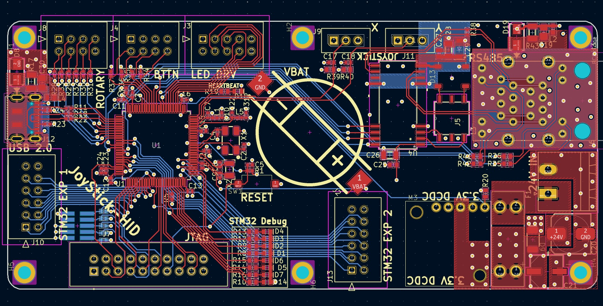
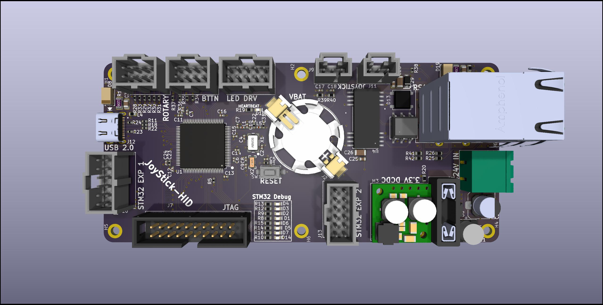
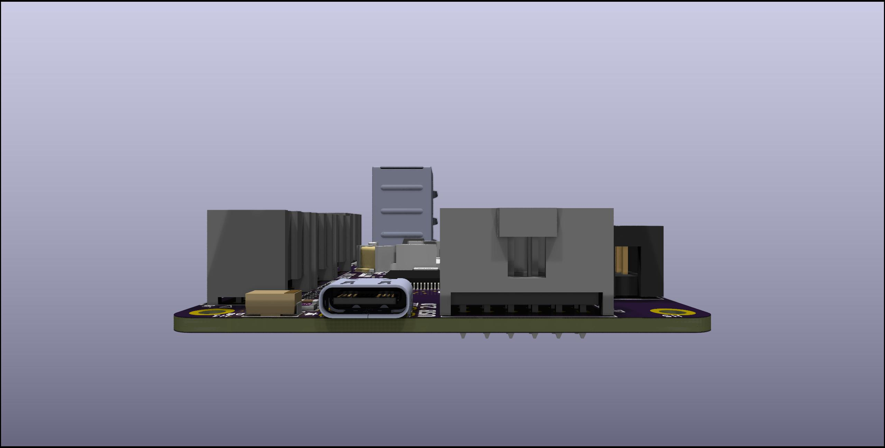
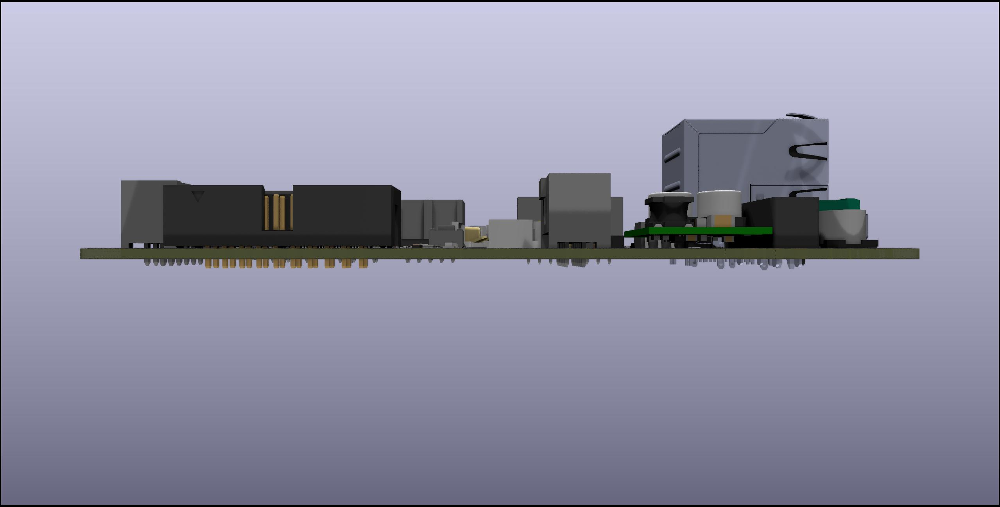
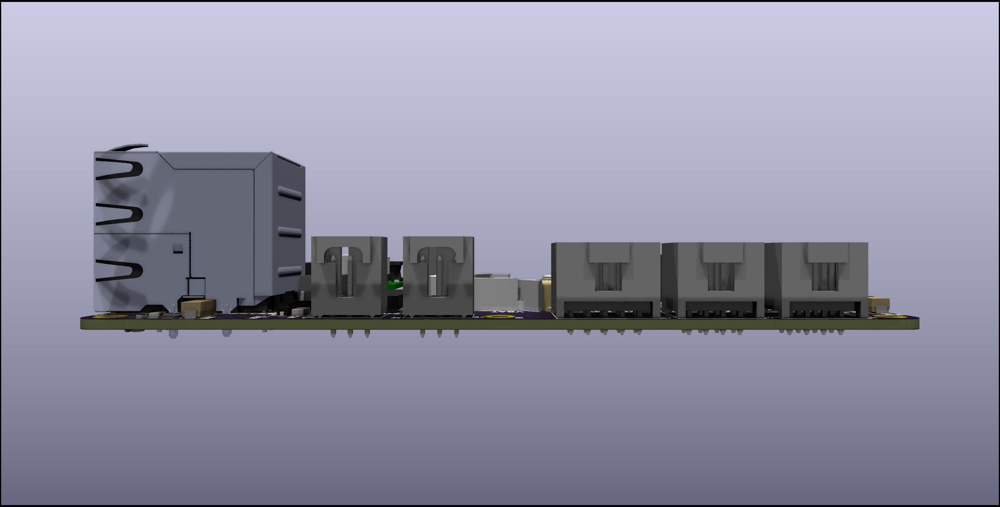
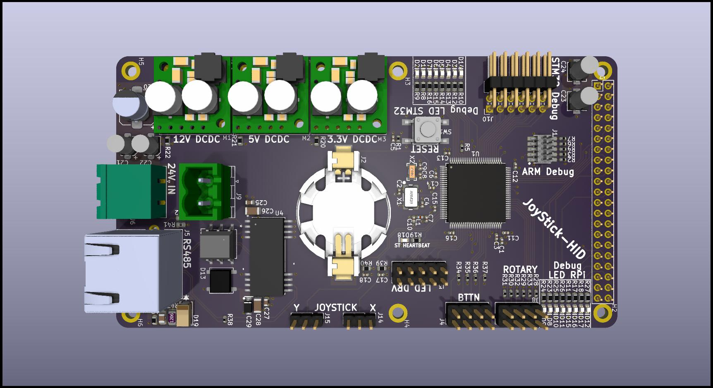
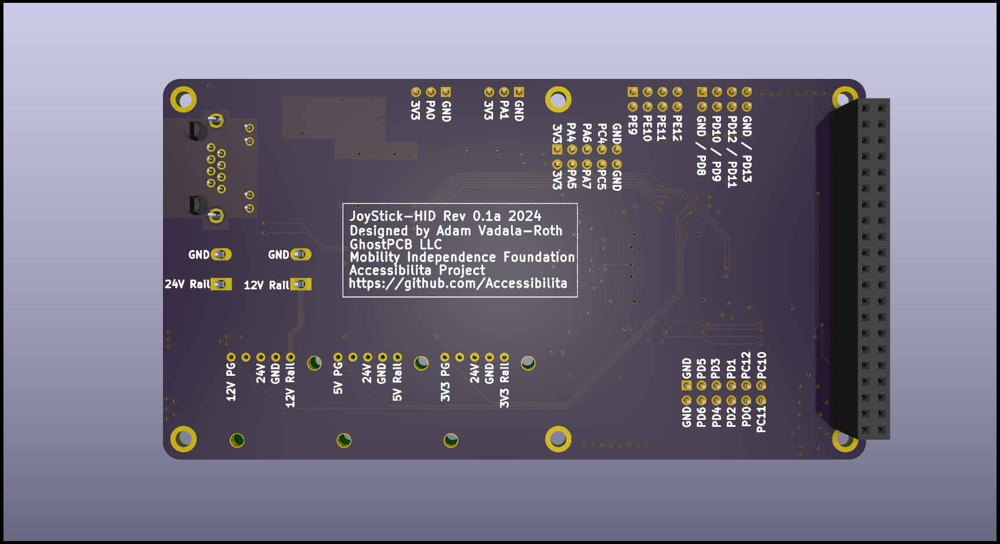
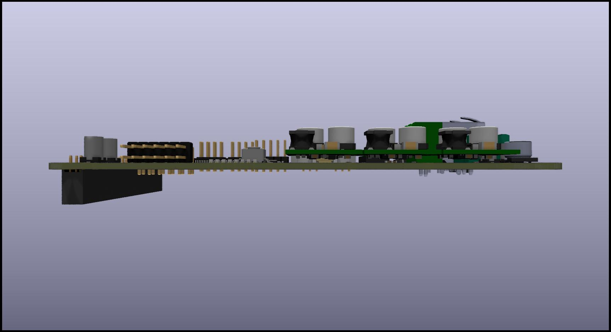

# Joystick-HID (0.2a)
A custom open source PCB for controlling an open source wheel chair! This PCB contains all the necessary electronics for interfacing and powering all the components/peripherals that will be used to build a wheel chair human machine interface consisting of this PCB, analog JoyStick module, buttons, rotary switches, and 3D printed housing. JoyStick-HID is just one of the many PCBs being developed for our open source wheel chair electrical system we are developing with the Accessibilita project for the Mobility Independence Foundation (themif.org) !!

Functional Block Diagram of Board 

Quick Specs of the Hat:
- STM32F446RET6 100TQFP ARM Cortex M4 Microcontoller
- ARM Cortex M Serial Debu Interface/connector for in system programming and development 
- MAX3535ECWI+T RS485 Transceiver for communicating with main motor controller
- D24V22F5 2.5A 5VDC Voltage Regulator Module
- D24V22F3 2.5A 3.3VDC Voltage Regulator Module
- 24V Power Input with High Current Pheonix Contact Connector
- 8 Debug LEDs for STM32F446RET6
- Onboard Battery for STM32F446RET6 RealTime Clock
- Interface for JoyStick, JH-D202X-R2/R4 Joystick 5K https://protosupplies.com/product/jh-d202x-r2-r4-joystick-5k/
- Interface for two Rotary Switches
- Interface for 8 Momentary swiches/buttons
- Interface for LED driver board, this additional board drives LEDs in the arm wrest indicating battery level and current set speed
- STM32 will run FreeRTOS w/ Custom Processes written for all functionality with priority scheduling for safety rated functions.

This hat is intended as a developmental platform that can function in the field, it has all the features needed to control the wheel chair with additional feature that will make software development easier. The final version will be much simpler and low cost, this is only the beginning. 

2D Render of JoyStick-HID Hat in KiCAD 8.0

3D Renders of JoyStick-HID Hat in KiCAD 8.0 3D Viewer 

# Joystick-Hat (0.1a)
Version 0.1a JoyStick HID:

RPi Hat for controlling an open source wheel chair! This hat contains all the necessary electronics for interfacing and powering all the components/peripherals that will be used to control the open source wheel chair electrical system we are developing with the Accessibilita project !!

Functional Block Diagram of Board 

Quick Specs of the Hat:
- STM32F446RET6 100TQFP ARM Cortex M4 Microcontoller
- ARM Cortex M Serial Debu Interface/connector for in system programming and development 
- MAX3535ECWI+T RS485 Transceiver for communicating with main motor controller
- D24V22F5 2.5A 5VDC Voltage Regulator Module
- D24V22F3 2.5A 3.3VDC Voltage Regulator Module
- D24V22F12 2.5A 12VDC Voltage Regulator Module
- 24V Power Input with High Current Pheonix Contact Connector
- 12V Power output with High current Phoenix Contact Connector
- Rapsberry Pi 5 Running ROS2, directly power via header from 5VDC rail
- 8 Debug LEDs for STM32F446RET6
- 8 Debug LEDs for RPi 5
- Onboard Battery for STM32F446RET6 RealTime Clock
- Interface for JoyStick, JH-D202X-R2/R4 Joystick 5K https://protosupplies.com/product/jh-d202x-r2-r4-joystick-5k/
- Interface for two Rotary Switches
- Interface for 8 Momentary swiches/buttons
- Interface for LED driver board, this additional board drives LEDs in the arm wrest indicating battery level and current set speed
- STM32 will run custom FreeRTOS or ROS-Micro more to follow

This hat is intended as a developmental platform that can function in the field, it has all the features needed to control the wheel chair with additional feature that will make software development easier. The final version will be much simpler and low cost, this is only the beginning. 

2D Render of JoyStick-HID Hat in KiCAD 8.0

3D Renders of JoyStick-HID Hat in KiCAD 8.0 3D Viewer 

# Joystick-Hat (0.1a) Prototype Assembly and Test:

Notes:
assmbely notes:
- Footprint for Raspberry Pi Header connector is wrong, its 42 pins should be 40
- 10uF caps on input = footprint too small!
- C19 footprint too big
- Max chip Pin 1 legend too hard to see
- RS485 diode orientation legend not on PCB
- STM32 Pin 1 legend not there
- Header holes for DCDC regulator modules too small had to hack them on there.
- ARM Cortex M Debug Connector issues, signals are flipped around, the footprint numbering doesn't correspond to the symbol numbering.
- All DCDC Regulators Work and produce correct voltage
- Debug LEDs Work
- GPIO and ADC Interfaces Work

Firmware:
Test firmware along with instructions on how to build and run can be found here: https://github.com/Accessibilita/JoyStick-hat-firmware

## Photos 

Version 0.1a of PCB 90% of Assembled and ready for programming test

Fix for the flpped programming interface from the symbol/footprint number error

Board Hooked Up to Programming Interface with soldered on fix 

Board Powered Up Running Code

